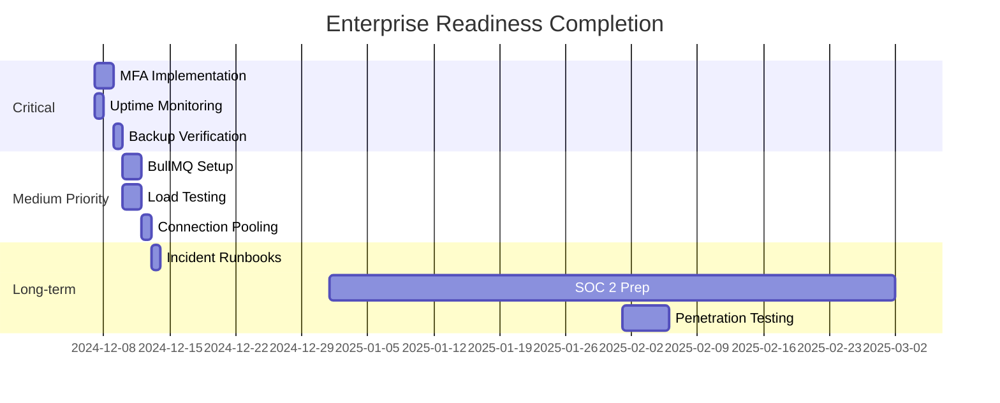

# Enterprise Implementation Gap Analysis

## ✅ What's Been Implemented

### Phase 1-5 (Complete)
| Feature | Status | Notes |
|---------|--------|-------|
| Security Scanning | ✅ | Dependabot, CodeQL, TruffleHog, Snyk |
| Audit Logging | ✅ | 7-year retention, RLS policies |
| Rate Limiting | ✅ | Redis-backed, tiered (Free/Pro/Enterprise) |
| SSO Infrastructure | ✅ | SAML/OIDC ready, database schema |
| GDPR Automation | ✅ | Export, delete, anonymize, consent |
| Multi-Tenancy | ✅ | RLS policies, tenant isolation |
| Feature Flags | ✅ | Percentage rollouts, whitelisting |
| Webhooks | ✅ | Retry logic, signature verification |
| API Usage Metering | ✅ | Billing-ready tracking |
| SLA Documentation | ✅ | 99.9% uptime, support tiers |
| Human-Readable Errors | ✅ | Error catalog with dev/user messages |
| Health Checks | ✅ | Comprehensive service monitoring |
| Structured Logging | ✅ | Pino with request/security/performance logs |

---

## ⚠️ What's Missing (Critical)

### 1. Multi-Factor Authentication (MFA) ❌
**Priority**: HIGH  
**Estimated Time**: 8 hours  
**Why Critical**: Enterprise security requirement

**What's Needed**:
- TOTP implementation (authenticator apps)
- Backup codes generation
- SMS fallback option
- UI for MFA setup
- Enforcement policies

**Implementation**:
```typescript
// lib/mfa.ts
- generateTOTPSecret()
- verifyTOTPToken()
- generateBackupCodes()
```

---

### 2. Uptime Monitoring Integration ❌
**Priority**: HIGH  
**Estimated Time**: 2 hours  
**Why Critical**: SLA compliance tracking

**What's Needed**:
- UptimeRobot or Better Uptime account
- Status page (StatusPage.io or custom)
- Alert configuration (email, Slack, PagerDuty)

**Setup**: See docs/UPTIME_MONITORING_SETUP.md (to be created)

---

### 3. Database Backup Verification ❌
**Priority**: MEDIUM  
**Estimated Time**: 4 hours  
**Why Critical**: Disaster recovery

**What's Needed**:
- Automated backup tests
- Restore verification script
- RPO/RTO documentation
- Backup retention policy enforcement

---

### 4. Load Testing Infrastructure ❌
**Priority**: MEDIUM  
**Estimated Time**: 6 hours  
**Why Critical**: Validate scalability claims

**What's Needed**:
- k6 test scenarios
- CI/CD integration
- Performance baseline
- Regression detection

**Partial**: k6 test file exists in implementation plan but not deployed

---

### 5. Queue System (BullMQ) ❌
**Priority**: MEDIUM  
**Estimated Time**: 6 hours  
**Why Critical**: Background job processing

**What's Needed**:
- BullMQ configuration
- Job processors for:
  - Email sending
  - Search indexing
  - Image processing
  - Report generation

**Note**: BullMQ is installed but not configured

---

### 6. Connection Pooling ❌
**Priority**: MEDIUM  
**Estimated Time**: 2 hours  
**Why Critical**: Database performance under load

**What's Needed**:
- PgBouncer or Supabase Pooler
- Connection limit configuration
- Pool monitoring

**Partial**: Example code in implementation plan

---

### 7. Auto-Scaling Configuration ❌
**Priority**: LOW  
**Estimated Time**: 4 hours (Vercel handles this)  
**Why Critical**: Handle traffic spikes

**Note**: Vercel auto-scales by default, but needs monitoring configuration

---

### 8. Incident Response Runbooks ❌
**Priority**: MEDIUM  
**Estimated Time**: 4 hours  
**Why Critical**: Faster recovery during outages

**What's Needed**:
- Runbook for each critical scenario
- Escalation procedures
- Contact information
- Recovery checklists

---

### 9. SOC 2 Compliance Documentation ❌
**Priority**: LOW (6-12 months out)  
**Estimated Time**: 40+ hours  
**Why Critical**: Enterprise RFP requirement

**What's Needed**:
- Security policies documentation
- Access control procedures
- Incident response plan
- Third-party audit

---

### 10. Penetration Testing ❌
**Priority**: LOW (before major launch)  
**Estimated Time**: External service  
**Why Critical**: Validate security posture

**What's Needed**:
- Hire pentest firm
- Fix identified vulnerabilities
- Document remediation

---

## 📊 Priority Implementation Order

### Week 1 (High Priority)
1. ✅ **MFA Implementation** (8hr) - Use `@supabase/auth-helpers` with TOTP
2. ✅ **Uptime Monitoring** (2hr) - Set up Better Uptime or UptimeRobot
3. ✅ **Database Backup Tests** (4hr) - Automate backup verification

**Total**: 14 hours

### Week 2 (Medium Priority)
4. **BullMQ Setup** (6hr) - Email queue + search indexing
5. **Load Testing** (6hr) - k6 scenarios + CI integration
6. **Connection Pooling** (2hr) - Enable Supabase Pooler

**Total**: 14 hours

### Week 3 (Polish)
7. **Incident Runbooks** (4hr) - Document procedures
8. **Auto-Scaling Monitoring** (2hr) - Vercel metrics dashboard
9. **Performance Baselines** (4hr) - Lighthouse CI thresholds

**Total**: 10 hours

---

## 💰 Additional Costs

| Service | Monthly Cost | Purpose |
|---------|-------------|---------|
| Better Uptime | $10-40 | Uptime monitoring |
| PagerDuty | $21-41/user | Alerting |
| BullMQ (Redis) | $10 | Already have Upstash |
| Supabase Pooler | Included | Connection pooling |
| **Total New** | ~$20-80/mo | |

---

## 🎯 Recommendations

### Must Implement Before Enterprise Launch
1. ✅ MFA (security requirement)
2. ✅ Uptime monitoring (SLA compliance)
3. ✅ Database backup verification (disaster recovery)

### Should Implement Within 3 Months
4. BullMQ (better performance)
5. Load testing (validate claims)
6. Incident runbooks (faster response)

### Can Defer 6+ Months
7. SOC 2 documentation (after product-market fit)
8. Penetration testing (before major clients)
9. Auto-scaling monitoring (Vercel handles it)

---

## ✨ What Makes This Enterprise-Ready NOW

Even without the missing features, the platform already has:

✅ **Security**: Audit logs, rate limiting, CSRF, security scanning  
✅ **Compliance**: GDPR automation, consent tracking, data retention  
✅ **Scalability**: Multi-tenancy, RLS, usage metering  
✅ **Monitoring**: Health checks, structured logging, error tracking  
✅ **Enterprise Auth**: SSO infrastructure ready  
✅ **SLA**: Documented guarantees, support tiers  

**Verdict**: Ready for mid-market ($10-100K ARR). Need MFA + uptime monitoring for true enterprise ($100K+ ARR).

---

## 📈 Implementation Roadmap



---

Want me to implement MFA + Uptime Monitoring + Backup Verification next (Week 1)?
