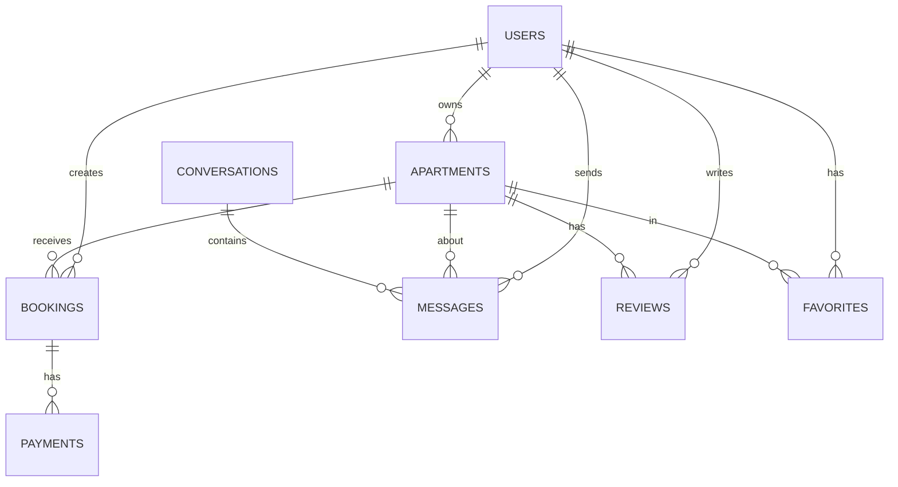

# Database Schema Documentation

## Overview

The Student Apartments platform uses PostgreSQL (via Supabase) as its primary database. The schema is designed for a multi-tenant apartment rental platform with real-time messaging, bookings, and payments.

## Entity Relationship Diagram



---

## Core Tables

### users (Supabase Auth)
Managed by Supabase Auth system.

**Key Fields:**
- `id` - UUID, primary key
- `email` - Text, unique
- `created_at` - Timestamp

---

### profiles_student
Student user profiles.

| Column | Type | Constraints | Description |
|--------|------|-------------|-------------|
| id | UUID | PK, FK → users.id | User ID |
| full_name | TEXT | NOT NULL | Full name |
| phone | TEXT | | Phone number |
| university | TEXT | | University name |
| preferences | JSONB | | Search preferences |
| personality_data | JSONB | | AI personality profile |
| created_at | TIMESTAMP | DEFAULT now() | Creation time |

**Indexes:**
- PRIMARY KEY (id)

---

### profiles_owner
Property owner profiles.

| Column | Type | Constraints | Description |
|--------|------|-------------|-------------|
| id | UUID | PK, FK → users.id | User ID |
| full_name | TEXT | NOT NULL | Full name |
| phone | TEXT | | Phone number |
| email | TEXT | | Contact email |
| stripe_account_id | TEXT | | Stripe Connect ID |
| payouts_enabled | BOOLEAN | DEFAULT false | Can receive payments |
| created_at | TIMESTAMP | DEFAULT now() | Creation time |

**Indexes:**
- PRIMARY KEY (id)
- INDEX on stripe_account_id

---

### apartments
Apartment listings.

| Column | Type | Constraints | Description |
|--------|------|-------------|-------------|
| id | UUID | PK | Apartment ID |
| owner_id | UUID | FK → users.id | Owner reference |
| title | TEXT | NOT NULL | Listing title |
| description | TEXT | | Full description |
| address | TEXT | NOT NULL | Street address |
| district | INTEGER | 1-23 | Budapest district |
| latitude | DECIMAL | | GPS latitude |
| longitude | DECIMAL | | GPS longitude |
| monthly_rent_huf | INTEGER | NOT NULL | Rent in HUF |
| price_huf | INTEGER | | Total price |
| bedrooms | INTEGER | | Number of bedrooms |
| bathrooms | INTEGER | | Number of bathrooms |
| size_sqm | DECIMAL | | Size in square meters |
| amenities | TEXT[] | | Array of amenities |
| photos | TEXT[] | | Photo URLs |
| is_available | BOOLEAN | DEFAULT true | Availability status |
| status | TEXT | DEFAULT 'draft' | published/draft |
| created_at | TIMESTAMP | DEFAULT now() | Creation time |
| updated_at | TIMESTAMP | | Last update |

**Indexes:**
- PRIMARY KEY (id)
- INDEX on owner_id
- INDEX on district
- INDEX on monthly_rent_huf
- INDEX on is_available, status
- GiST INDEX on (latitude, longitude) for location queries

---

### bookings
Booking requests and confirmations.

| Column | Type | Constraints | Description |
|--------|------|-------------|-------------|
| id | UUID | PK | Booking ID |
| apartment_id | UUID | FK → apartments.id | Apartment reference |
| student_id | UUID | FK → users.id | Student reference |
| owner_id | UUID | FK → users.id | Owner reference |
| check_in | DATE | NOT NULL | Move-in date |
| check_out | DATE | | Move-out date |
| total_price | INTEGER | | Total amount |
| status | TEXT | DEFAULT 'pending' | Status (pending/confirmed/cancelled/completed) |
| payment_intent_id | TEXT | | Stripe payment ID |
| created_at | TIMESTAMP | DEFAULT now() | Creation time |

**Indexes:**
- PRIMARY KEY (id)
- INDEX on apartment_id
- INDEX on student_id
- INDEX on owner_id
- INDEX on status
- INDEX on payment_intent_id

**Status Flow:**
```
pending → confirmed → completed
   ↓
cancelled
```

---

### conversations
Message conversations between users.

| Column | Type | Constraints | Description |
|--------|------|-------------|-------------|
| id | UUID | PK | Conversation ID |
| apartment_id | UUID | FK → apartments.id | Related apartment |
| student_id | UUID | FK → users.id | Student participant |
| owner_id | UUID | FK → users.id | Owner participant |
| last_message_at | TIMESTAMP | | Last message time |
| last_message_preview | TEXT | | Preview text |
| unread_count_student | INTEGER | DEFAULT 0 | Student unread count |
| unread_count_owner | INTEGER | DEFAULT 0 | Owner unread count |
| status | TEXT | DEFAULT 'active' | Conversation status |
| created_at | TIMESTAMP | DEFAULT now() | Creation time |

**Indexes:**
- PRIMARY KEY (id)
- INDEX on student_id
- INDEX on owner_id
- UNIQUE INDEX on (apartment_id, student_id, owner_id)

---

### messages
Individual messages within conversations.

| Column | Type | Constraints | Description |
|--------|------|-------------|-------------|
| id | UUID | PK | Message ID |
| conversation_id | UUID | FK → conversations.id | Conversation reference |
| sender_id | UUID | FK → users.id | Sender reference |
| receiver_id | UUID | FK → users.id | Receiver reference |
| content | TEXT | NOT NULL | Message content |
| read_at | TIMESTAMP | | Read timestamp |
| message_type | TEXT | DEFAULT 'text' | Message type |
| metadata | JSONB | | Additional data |
| created_at | TIMESTAMP | DEFAULT now() | Creation time |

**Indexes:**
- PRIMARY KEY (id)
- INDEX on conversation_id
- INDEX on sender_id
- INDEX on receiver_id
- INDEX on read_at (for unread queries)

---

### reviews
Apartment reviews from students.

| Column | Type | Constraints | Description |
|--------|------|-------------|-------------|
| id | UUID | PK | Review ID |
| apartment_id | UUID | FK → apartments.id | Apartment reference |
| user_id | UUID | FK → users.id | Reviewer reference |
| booking_id | UUID | FK → bookings.id | Related booking |
| overall_rating | INTEGER | 1-5 | Overall rating |
| title | TEXT | NOT NULL | Review title |
| content | TEXT | NOT NULL | Review content |
| pros | TEXT[] | | Positive aspects |
| cons | TEXT[] | | Negative aspects |
| is_verified | BOOLEAN | DEFAULT false | Verified booking |
| is_anonymous | BOOLEAN | DEFAULT false | Anonymous review |
| created_at | TIMESTAMP | DEFAULT now() | Creation time |

**Indexes:**
- PRIMARY KEY (id)
- INDEX on apartment_id
- INDEX on user_id
- INDEX on overall_rating

---

### favorites
User favorite apartments.

| Column | Type | Constraints | Description |
|--------|------|-------------|-------------|
| user_id | UUID | FK → users.id | User reference |
| apartment_id | UUID | FK → apartments.id | Apartment reference |
| created_at | TIMESTAMP | DEFAULT now() | Creation time |

**Indexes:**
- PRIMARY KEY (user_id, apartment_id)
- INDEX on apartment_id

---

## Supporting Tables

### payment_transactions
Payment history and tracking.

| Column | Type | Constraints | Description |
|--------|------|-------------|-------------|
| id | UUID | PK | Transaction ID |
| booking_id | UUID | FK → bookings.id | Related booking |
| provider | TEXT | | Payment provider (stripe) |
| provider_session_id | TEXT | | Stripe session ID |
| amount_huf | INTEGER | | Amount in HUF |
| status | TEXT | | pending/succeeded/failed |
| metadata | JSONB | | Additional data |
| created_at | TIMESTAMP | DEFAULT now() | Creation time |

---

### ranking_events
AI scoring events for analytics.

| Column | Type | Constraints | Description |
|--------|------|-------------|-------------|
| id | UUID | PK | Event ID |
| user_id | UUID | FK → users.id | User reference |
| apartment_id | UUID | FK → apartments.id | Apartment reference |
| score | DECIMAL | | AI-generated score |
| reasons | TEXT[] | | Scoring reasons |
| created_at | TIMESTAMP | DEFAULT now() | Event time |

---

## Migration Strategy

### Development
```sql
-- Run migrations
npm run db:migrate

-- Seed test data
npm run db:seed
```

### Production
1. Create migration file in `supabase/migrations/`
2. Test in staging  
3. Apply to production via Supabase dashboard
4. Verify with health checks

### Rollback
- Supabase manages version history
- Can revert via dashboard
- Keep backup before major schema changes

---

## Indexing Strategy

### Performance Indexes
- **Foreign Keys:** All FK columns indexed
- **Search Fields:** district, price, status
- **Geospatial:** GiST index on coordinates
- **Composite:** (status, is_available) for listings

### Monitoring
```sql
-- Find slow queries
SELECT * FROM pg_stat_statements 
ORDER BY mean_exec_time DESC 
LIMIT 10;

-- Check index usage
SELECT schemaname, tablename, indexname, idx_scan
FROM pg_stat_user_indexes
ORDER BY idx_scan ASC;
```

---

## Row Level Security (RLS)

### apartments
- Owners can CRUD their own listings
- Public can READ published listings

### messages
- Users can only READ/WRITE their own messages

### bookings
- Students see their bookings
- Owners see bookings for their apartments

---

**Last Updated:** December 7, 2025  
**Schema Version:** 1.0
